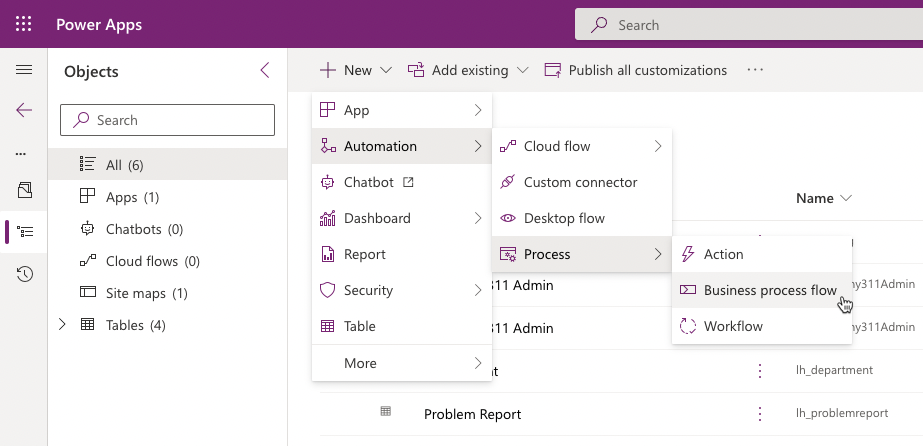
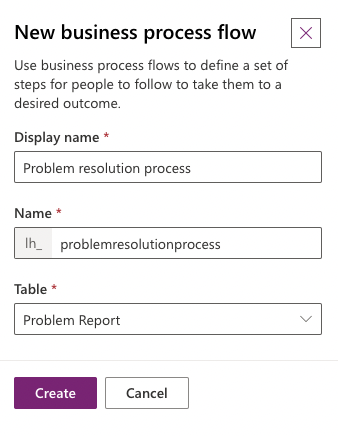

---
lab:
    title: 'Lab 02.2: Business Process Flows and Business Rules'
    module: 'Module 02: Building model-driven apps'
---

> [!NOTE]
> Effective November 2020:
>
> - Common Data Service has been renamed to Microsoft Dataverse. [Learn more](https://aka.ms/PAuAppBlog)
> - Some terminology in Microsoft Dataverse has been updated. For example, *entity* is now *table* and *field* is now *column*. [Learn more](https://go.microsoft.com/fwlink/?linkid=2147247)
>

# Lab 02.2: Business Process Flows and Business Rules

In this lab you will enhance the data model and improve the app behavior by adding a business process flow and a business rule.

## What you will learn

  - How to identify stages in a Business Process Flow (BPF)

  - How to create and use a BPF

  - How to use a business rule to implement logic

## High-level lab steps

  - Exercise 1 – Create BPF lifecycle of problem report
    
      - Route 
      
      - Fix 
      
      - Resolved 

  - Exercise 2 – Business rule to not allow close without resolution

## Prerequisites

* Must have completed **Lab 02.1: Data model and model-driven app**

## Detailed steps

### Exercise 1: Create business process flow

In this exercise, you will create a business process flow for the problem report table.

#### Task 1: Customize Table

In this task, you will add a lookup Column to the problem report table.

1.  Navigate to the [Power Apps maker portal](https://make.powerapps.com/) page and make sure you are in the correct environment.

2.  Select **Solutions** and click to open the **Company 311** solution.

3.  Locate and click to open the **Problem Report** table.

4.  Click **+ New**, then click **Column**.

5.  Enter **Assign to** for **Display name**, select **Lookup** for **Data type**, select **User** for **Related table**, and click **Save**.

6.  Select **All** in the **Objects** navigation tree.

7.  Click **Publish all customizations** and wait for the publishing to complete.

#### Task 2: Create business process flow

In this task, you will create a business process flow for the Problem Report table.

1.  Navigate to the [Power Apps maker portal](https://make.powerapps.com/) page and make sure you are in the correct environment.

2.  Select **Solutions** and click to open the **Company 311** solution.

3.  Click **+ New > Automation > Process > Business process flow**.

4. In the **New busines process flow** panel enter **Problem resolution process** for **Display name**, select **Problem Report** for **Table**, and click **Create**.

5.  Select the **New stage**, go to the **Properties** pane, change the **Display Name** to **Route**, and click **Apply**.

6.  Expand **Details** of the **Route** stage.

7.  Select **Data Step \#1**, go to the **Properties** pane, select **Building** for **Data Field**, and click **Apply**.

8.  Click **+ Add** and select **Add Data Step**.

9. Select the **+** option to add the data step below the **Building** data step.

   

10. Select the new data step, go to the **Properties** pane, select **Location** for **Data Field**, and click **Apply**.

11. Click **+ Add** again and select **Add Data Step**.

12. Select the new data step, go to the **Properties** pane, select **Department** for **Data Field**, and click **Apply**.

13. The **Route** stage should now look like the image below.

14. Click **+ Add** and select **Add Stage**.

15. Add the new stage after the **Route** stage.

16. Select the stage, go to the **Properties** pane, enter **Fix** for **Display Name**, and click **Apply**.

17. Expand **Details** of the **Fix** stage.

18. Select **Data Step \#1** of the **Fix** stage.

19. Go to the **Properties** pane, select **Assign to** for **Data Field** and click **Apply**.

20. Click **+ Add** and select **Add Stage**.

21. Add the new stage after the **Fix** stage.

22. Select the new stage, go to the **Properties** pane, enter **Resolve** for **Display Name** and click **Apply**.

23. Expand **Details** of the **Resolve** stage.

24. Select **Data Step \#1** of the **Resolve** stage.

25. Go to the **Properties** pane, select **Resolution** for **Data Field** and click **Apply**.

26. Click **+ Add** and select **Add Data Step**.

27. Add the new data step below the **Resolution** data step.

28. Select the new data step, go to the **Properties** pane, select **Resolved on** for **Date Field** and click **Apply**.

29. The Business process flow should now look like the image below. Click **Save**.

30. Click **Activate**.

31. Click **Activate** again on the pop-up.

32. Confirm that **Status: Active** on the bottom-left side of the screen.

    

33. Close the process editor browser window or tab.

34. Click **Done**.

### Exercise 2: Create business rule

In this exercise, you will create a business rule that will block completion of problems without resolution.

#### Task 1: Create business rule

1.  Navigate to the [Power Apps maker portal](https://make.powerapps.com/) page and make sure you are in the correct environment.

2.  Select **Solutions** and click to open the **Company 311** solution.

3.  Locate and click to open the **Problem Report** Table.

4.  Select the **Business rules** tab and click **Add business rule**.

5.  Make sure the **Scope** is set to **Entity** and click **Show details** chevron.

6. Change **Business rule name** to **Completion rule** and click **Hide details** chev

7. Select the **Condition**.

8. Go to the **Properties** pane and change the **Display name** to **Resolution required**.

9. Scroll down to **Rule 1**, select **Status Reason** for **Field**, select **Equals** for **Operator**, select **Value** for **Type**, select **Completed** for **Value**, and click **Apply**.

10. Click **+ New**.

11. Scroll down to **Rule 2**, select **Resolution** for **Field**, select **Does not contain data** for **Operator**, make sure **And** is selected for **Rule Logic**, and click **Apply**.

12. Click **+ Add**.

13. Select **Add show error message**.

14. Add the action on the **true** path of the condition.

15. Select the new action, go to the **Properties** pane, enter **Show message** for **Display Name**, select **Status Reason** for **Field**, enter **The Problem must have a resolution before it can be closed** for **Message**, and click **Apply**.

16. The business rule should now look like the image below. Click **Save**.

17. Click **Activate**.
18. Click **Activate** again on the pop-up.
19. Confirm activation.
20. Close the process editor browser window or tab.
21. Click **Done**.

### Exercise 3: Test processes

In this exercise, you will test the business process flow and the business rule you created.

#### Task 1: Test processes

1.  Navigate to the [Power Apps maker portal](https://make.powerapps.com/) page and make sure you are in the correct environment.

2.  Select **Apps** and click to open the **Company 311 Admin** application.

3.  Select **Problem Reports** and click **+ New**.

4.  You should see the business process flow stages. Enter **Dark parking lot** for **Title**, select **London Paddington** for **Building**, enter **There are no lights at the north end of the parking lot** for **Details**, and click **Save**.

5.  Click on the **Route** stage.

6. Enter **North-end** for **Location**, select **Facility Maintenance** for **Department** and select the **Next stage** stage.

> [!NOTE]
>If the Next Stage option is not visible, then refresh the page.

7. Select a user for **Assign to** and click **Next stage**.

8. Select date and time for the **Resolved on** and leave the **Resolution** value empty.

9. Scroll down to the resolution details section and select **Completed** for **Status Reason**. You should see the business rule error message.

10. Provide **Resolution**. The error message should go away.

11. **Save** the Row.

